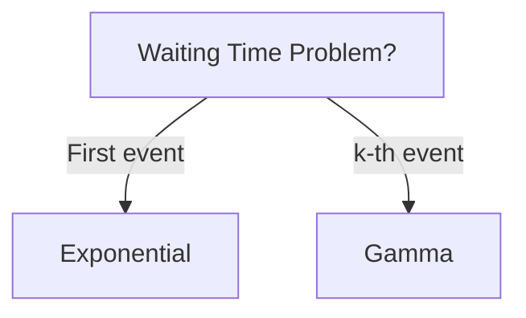

# Gamma Distribution

> [!abstract] Posisi dalam Exam P
> - **Learning Objective**: LO P-3, LO P-4  
> - **Kategori**: Univariate Continuous Distributions  
> - **Bobot**: ~5–8%  
> - **Prerequisite**: [[Integral Calculus]], [[Continuous Random Variables]], [[Exponential Distribution]], [[Ekspektasi dan Varians]]  
> - **Related Topics**: [[Poisson Process]], [[Chi-Square Distribution]], [[Moment Generating Functions]]

---

## 1. Intuisi

> [!tip] Intuisi
> Bayangkan Anda adalah seorang aktuaris yang mengamati **total waktu** hingga suatu peristiwa terjadi **beberapa kali**, bukan hanya sekali.  
>  
> Jika *Exponential distribution* menjawab pertanyaan *“berapa lama sampai kejadian pertama?”*, maka **Gamma distribution** menjawab *“berapa lama sampai kejadian ke-$k$?”*.  
>  
> Contoh nyata:  
> - Waktu total sampai klaim ke-3 terjadi  
> - Waktu sampai mesin mengalami kegagalan setelah 5 shock  
> - Akumulasi beberapa waiting time acak  
>  
> Intinya: **Gamma adalah distribusi untuk penjumlahan beberapa waiting time acak.**

---

## 2. Definisi Formal

> [!info] Definisi Formal
> **Definisi:**  
> Suatu variabel acak kontinu $X$ dikatakan mengikuti **Gamma distribution** dengan parameter *shape* $\alpha$ dan *scale* $\theta$, ditulis $X \sim \text{Gamma}(\alpha, \theta)$, jika fungsi kepadatan peluangnya adalah:
> 
> $$
> f_X(x) =
> \begin{cases}
> \dfrac{1}{\Gamma(\alpha)\theta^\alpha} x^{\alpha-1} e^{-x/\theta}, & x > 0 \\
> 0, & \text{lainnya}
> \end{cases}
> $$
> 
> **Parameter:**
> - $\alpha$ (*shape*), dengan constraint $\alpha > 0$
> - $\theta$ (*scale*), dengan constraint $\theta > 0$
> 
> **Support:**
> $$
> X \in (0, \infty)
> $$

### Fungsi Gamma

$$
\Gamma(\alpha) = \int_{0}^{\infty} x^{\alpha-1} e^{-x} \, dx
$$

Jika $\alpha \in \mathbb{N}$, maka:
$$
\Gamma(\alpha) = (\alpha - 1)!
$$

### Momen Penting

- **Ekspektasi:**
$$
E[X] = \alpha \theta
$$

- **Varians:**
$$
\text{Var}(X) = \alpha \theta^2
$$

- **Moment Generating Function (MGF):**
$$
M_X(t) = (1 - \theta t)^{-\alpha}, \quad t < \frac{1}{\theta}
$$

---

## 3. Jembatan Logika

> [!note] Jembatan: Intuisi → Matematika
> - Faktor $x^{\alpha-1}$ mencerminkan **akumulasi kejadian**: semakin besar $\alpha$, semakin “berat” distribusi ke kanan.  
> - Faktor $e^{-x/\theta}$ merepresentasikan *exponential decay*, yaitu penalti untuk waktu yang terlalu besar.  
> - Konstanta $\dfrac{1}{\Gamma(\alpha)\theta^\alpha}$ memastikan bahwa:
> $$
> \int_0^\infty f_X(x)\,dx = 1
> $$
>  
> Hubungan penting:
> - Jika $\alpha = 1$, maka Gamma berubah menjadi **[[Exponential Distribution]]**:
> $$
> \text{Gamma}(1,\theta) = \text{Exponential}(\theta)
> $$
>  
> Interpretasi konstruktif (sangat penting untuk Exam P):
> Jika $X_1, X_2, \dots, X_\alpha$ i.i.d. $\sim \text{Exponential}(\theta)$, maka:
> $$
> \sum_{i=1}^{\alpha} X_i \sim \text{Gamma}(\alpha,\theta)
> $$

---

## 4. Contoh Soal

> [!example] Contoh Soal A (Fundamental)
> **Soal:**  
> Jika $X \sim \text{Gamma}(3,2)$, hitung $E[X]$ dan $\text{Var}(X)$.
> 
> **Solusi:**
> 1. **Identifikasi Informasi:**  
>    - $\alpha = 3$, $\theta = 2$
> 
> 2. **Setup:**  
> $$
> E[X] = \alpha\theta, \quad \text{Var}(X)=\alpha\theta^2
> $$
> 
> 3. **Eksekusi:**  
> $$
> E[X] = 3(2)=6
> $$
> $$
> \text{Var}(X)=3(2^2)=12
> $$
> 
> 4. **Verification:**  
>    - ✓ Nilai positif  
>    - ✓ Konsisten dengan definisi

---

> [!example] Contoh Soal B (Exam-Typical)
> **Soal:**  
> Jika $X \sim \text{Gamma}(2,1)$, hitung $P(X>3)$.
> 
> **Solusi:**
> 1. **Identifikasi:**  
>    PDF: $f_X(x)=x e^{-x}$, $x>0$
> 
> 2. **Setup:**  
> $$
> P(X>3)=\int_3^\infty x e^{-x} dx
> $$
> 
> 3. **Eksekusi:**  
> $$
> \int x e^{-x}dx = -(x+1)e^{-x}
> $$
> 
> $$
> P(X>3) = (3+1)e^{-3} = 4e^{-3}
> $$
> 
> 4. **Verification:**  
>    - ✓ $0 < 4e^{-3} < 1$

---

> [!example] Contoh Soal C (Challenging)
> **Soal:**  
> Misalkan $X_1, X_2, X_3$ i.i.d. $\sim \text{Exponential}(2)$. Hitung:
> $$
> P(X_1+X_2+X_3 \le 4)
> $$
> 
> **Solusi:**
> 1. **Identifikasi:**  
>    Jumlah 3 exponential → Gamma:
> $$
> X \sim \text{Gamma}(3,2)
> $$
> 
> 2. **Setup (CDF closed form):**
> $$
> P(X\le x)=1-e^{-x/\theta}\left(1+\frac{x}{\theta}+\frac{x^2}{2\theta^2}\right)
> $$
> 
> 3. **Eksekusi:**  
> $$
> P(X\le 4)=1-e^{-2}(1+2+2)=1-5e^{-2}
> $$
> 
> 4. **Verification:**  
>    - ✓ Probabilitas valid

---

## 5. Verification & Sanity Check

> [!success] Verification & Sanity Check
> ✓ Semua probabilitas berada pada interval $[0,1]$  
> ✓ $P(X<\infty)=1$  
> ✓ Mean meningkat seiring $\alpha$ meningkat  
> ✓ Konsisten dengan interpretasi [[Poisson Process]]

---

## 6. Visualisasi Mental

> [!quote] Visualisasi Mental
> - **PDF**: Kurva *right-skewed*  
>   - $\alpha$ kecil → tajam di kiri  
>   - $\alpha$ besar → mendekati bentuk [[Normal Distribution]]  
> - **CDF**: Kurva halus dari 0 menuju 1  
>  
> Area di bawah kurva PDF merepresentasikan probabilitas.

---

## 7. Jebakan Umum

> [!warning] Jebakan Umum (Exam Traps)
> **Kesalahan Notasi:**
> - ✗ Menggunakan $\lambda$ tanpa definisi → ✓ Gunakan $\theta$ (scale) secara eksplisit
> 
> **Kesalahan Konseptual:**
> - Misconception: *Gamma bersifat memoryless*  
> - Mengapa salah: hanya **[[Exponential Distribution]]** yang memoryless  
> 
> **Red Flags Exam:**
> - “Time until the $k$-th event” → **Gamma**
> - “Sum of exponentials” → **Gamma**

---

## 8. Ringkasan Eksekutif

> [!summary] Exam Cheat Sheet
> **Must-Remember:**
> 1. $E[X]=\alpha\theta$
> 2. $\text{Var}(X)=\alpha\theta^2$
> 3. Gamma = jumlah i.i.d exponential
> 4. $\Gamma(n)=(n-1)!$ untuk $n\in\mathbb{N}$
> 
> **Kapan Digunakan:**
> - Waiting time ke-$k$
> - Total waktu beberapa kejadian
> - Poisson process timing
> 
> **Kapan TIDAK Digunakan:**
> - Jika hanya kejadian pertama → gunakan [[Exponential Distribution]]

---
---

## 📚 References

- **Primary**: Ross, S. (2014). *A First Course in Probability*, Chapter 5  
- **Secondary**: Hogg, R., Tanis, E., & Zimmerman, D. (2015). *Probability and Statistical Inference*, Section 4.4  
- **SOA**: Exam P Learning Objectives P-3, P-4  

---

## 🔗 Related Notes

- [[Exponential Distribution]]
- [[Poisson Process]]
- [[Moment Generating Functions]]
- [[Chi-Square Distribution]]

---

## 📝 Study Log

- [ ] Read intuition section
- [ ] Understand formal definition
- [ ] Solve Contoh Soal A
- [ ] Solve Contoh Soal B
- [ ] Solve Contoh Soal C
- [ ] Review common traps
- [ ] Memorize cheat sheet

---

**Last Updated:** {{date:YYYY-MM-DD}}  
**Next Review:** [Spaced repetition date]

---

### 📁 Vault Organization (Recommended)

- **Folder**:  
  `Actuarial Science/Exam P/02 - Univariate Distributions/`

- **Filename**:  
  `ExamP - Distributions - Gamma Distribution.md`
