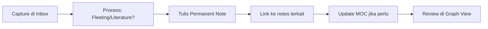

# Obsidian Advanced Guide
> [!info] Panduan ini mencakup **Dataview**, **Plugin Ecosystem**, dan **Zettelkasten Workflow** — tiga pilar untuk mengubah Obsidian dari note-taking app menjadi personal knowledge management system yang powerful.

---

## 1. Dataview — Vault Kamu Sebagai Database

Dataview mengubah setiap note di vault kamu menjadi *row* dalam database yang bisa di-query. Ini plugin **paling transformatif** di ekosistem Obsidian.

### 1.1 Instalasi & Setup

1. Settings → Community Plugins → Turn on community plugins
2. Browse → cari "Dataview" → Install → Enable
3. Di Dataview settings, aktifkan **Enable JavaScript Queries** dan **Enable Inline Queries**

### 1.2 Frontmatter — Foundation dari Dataview

Setiap note bisa punya metadata YAML di bagian atas:

```yaml
---
type: study-note
subject: actuarial-science
exam: ASAI
topic: probability
status: in-progress
date: 2026-03-13
difficulty: hard
tags:
  - matematika
  - probabilitas
---
```

> [!tip] Best Practice Frontmatter
> - Gunakan lowercase dan kebab-case untuk key (`study-note`, bukan `Study Note`)
> - Konsisten dengan value — pick satu format dan stick with it
> - `tags` bisa di frontmatter ATAU inline pakai `#tag`

### 1.3 Dataview Query Language (DQL)

Syntax dasar:

```
TABLE/LIST/TASK <field1>, <field2>
FROM <source>
WHERE <condition>
SORT <field> ASC/DESC
LIMIT <number>
GROUP BY <field>
```

#### Contoh: Tabel Study Notes

````markdown
```dataview
TABLE subject, status, difficulty, date
FROM "Study"
WHERE type = "study-note" AND exam = "ASAI"
SORT date DESC
```
````

#### Contoh: List Notes yang Belum Selesai

````markdown
```dataview
LIST
FROM #actuarial
WHERE status != "done"
SORT date ASC
```
````

#### Contoh: Task Tracker dari Seluruh Vault

````markdown
```dataview
TASK
FROM "Projects"
WHERE !completed
GROUP BY file.link
```
````

#### Contoh: Hitung Jumlah Notes per Subject

````markdown
```dataview
TABLE length(rows) AS "Jumlah Notes"
FROM "Study"
WHERE type = "study-note"
GROUP BY subject
```
````

### 1.4 Inline Queries

Kamu bisa embed query langsung di dalam teks:

```markdown
Saya sudah buat `= length(filter(this.file.tasks, (t) => t.completed))` tasks hari ini.

Terakhir diupdate: `= this.file.mtime`
```

### 1.5 DataviewJS — Full JavaScript Power

Untuk query yang lebih kompleks, pakai DataviewJS:

````markdown
```dataviewjs
// Dashboard: progress belajar per topik
const pages = dv.pages('"Study"')
  .where(p => p.exam === "ASAI");

const done = pages.where(p => p.status === "done").length;
const total = pages.length;
const pct = Math.round((done / total) * 100);

dv.paragraph(`## Progress ASAI: ${done}/${total} (${pct}%)`);

dv.table(
  ["Topic", "Status", "Difficulty"],
  pages
    .sort(p => p.difficulty, 'desc')
    .map(p => [p.file.link, p.status, p.difficulty])
);
```
````

### 1.6 Implicit Fields yang Berguna

Dataview otomatis menyediakan metadata tanpa kamu harus tulis sendiri:

| Field | Deskripsi |
|---|---|
| `file.name` | Nama file tanpa ekstensi |
| `file.link` | Link ke file |
| `file.size` | Ukuran file |
| `file.ctime` | Waktu dibuat |
| `file.mtime` | Waktu terakhir dimodifikasi |
| `file.tags` | Semua tags di file |
| `file.inlinks` | Notes yang link KE file ini |
| `file.outlinks` | Notes yang file ini link ke |
| `file.tasks` | Semua tasks di file |
| `file.folder` | Folder tempat file berada |

---

## 2. Plugin Ecosystem & Advanced Setup

### 2.1 Essential Plugins (Tier 1 — Install Dulu)

#### Templater
Template engine advanced dengan JavaScript support.

```markdown
<%* 
const title = await tp.system.prompt("Judul note:");
await tp.file.rename(title);
-%>
# <% title %>
Created: <% tp.date.now("YYYY-MM-DD") %>
Type: study-note
```

Fitur utama:
- **Dynamic dates**: `<% tp.date.now("YYYY-MM-DD") %>`, `<% tp.date.now("dddd", 7) %>` (7 hari dari sekarang)
- **User prompts**: `<% tp.system.prompt("Question") %>`, `<% tp.system.suggester(["A","B"], ["A","B"]) %>`
- **File operations**: rename, move, create dari template
- **Folder templates**: otomatis apply template berdasarkan folder

#### Calendar
Plugin sederhana tapi essential — sidebar calendar yang terintegrasi dengan Daily Notes dan Periodic Notes.

#### Periodic Notes
Extend Daily Notes ke weekly, monthly, quarterly, yearly. Cocok untuk review cycles.

#### Tasks
Full-featured task management:

```markdown
- [ ] Belajar bab 3 probabilitas 📅 2026-03-15 ⏫
- [ ] Review soal latihan 🔁 every week 📅 2026-03-20
- [x] Baca chapter 1 ✅ 2026-03-10
```

Query tasks dari seluruh vault:

````markdown
```tasks
not done
due before next week
sort by due
group by folder
```
````

### 2.2 Power User Plugins (Tier 2)

#### Excalidraw
Drawing & diagramming langsung di Obsidian. Cocok untuk:
- Visualisasi konsep actuarial
- Mind maps
- Flowcharts dan decision trees

#### Kanban
Markdown-based kanban boards:

```markdown
---
kanban-plugin: basic
---
## Backlog
- [ ] Topic A

## In Progress
- [ ] Topic B

## Done
- [x] Topic C
```

#### QuickAdd
Macro system untuk Obsidian — combine capture, template, dan script actions jadi satu command.

Contoh workflow:
1. Trigger QuickAdd → pilih "New Study Note"
2. Prompt muncul: isi subject, topic, difficulty
3. Note otomatis dibuat dengan template + frontmatter terisi

#### Commander
Tambah custom buttons ke UI — header bar, sidebar, status bar. Pin command yang sering kamu pakai.

#### Linter
Auto-format markdown kamu on save:
- Fix heading levels
- Consistent spacing
- YAML sort
- Trailing spaces cleanup

### 2.3 Appearance & UX Plugins (Tier 3)

#### Style Settings
Kalau kamu pakai theme (Minimal, AnuPpuccin, dll), plugin ini kasih GUI untuk tweak semua variabelnya tanpa edit CSS manual.

#### Hider
Sembunyikan elemen UI yang nggak kamu butuhkan.

#### Various Complements
Auto-complete untuk internal links, frontmatter values, bahkan kustom dictionary.

### 2.4 CSS Snippets

Buat file `.css` di `.obsidian/snippets/`, lalu enable di Settings → Appearance:

```css
/* Contoh: Custom callout untuk actuarial formulas */
.callout[data-callout="formula"] {
  --callout-color: 139, 92, 246;
  --callout-icon: lucide-sigma;
}

/* Contoh: Wider content area */
.markdown-source-view.mod-cm6 .cm-content,
.markdown-preview-view {
  max-width: 900px !important;
  margin: auto;
}
```

Penggunaan di note:

```markdown
> [!formula] Present Value of Annuity
> $$a_{\overline{n}|} = \frac{1 - v^n}{i}$$
```

### 2.5 Hotkeys & Workspace Setup

> [!tip] Recommended Hotkeys
> - `Ctrl+O` — Quick switcher (sudah default)
> - `Ctrl+Shift+F` — Search seluruh vault
> - `Ctrl+P` — Command palette
> - Custom: `Ctrl+N` → QuickAdd capture
> - Custom: `Ctrl+T` → New note from template

Workspace Layouts bisa disimpan — bikin layout berbeda untuk "Study Mode", "Writing Mode", "Review Mode".

---

## 3. Zettelkasten & Knowledge Management Workflow

### 3.1 Apa itu Zettelkasten?

Metode note-taking dari Niklas Luhmann. Prinsip intinya:
- **Atomic notes** — satu note = satu ide/konsep
- **Unique IDs** — setiap note punya identifier unik
- **Linking** — hubungkan notes yang berkaitan
- **Emergent structure** — struktur muncul dari koneksi, bukan dari folder hierarchy

### 3.2 Arsitektur Vault

```
Vault/
├── 00 Inbox/          ← Capture cepat, belum diproses
├── 01 Fleeting/       ← Ide sementara, quick thoughts
├── 02 Literature/     ← Notes dari sumber (buku, artikel, video)
├── 03 Permanent/      ← Atomic notes — core knowledge
├── 04 Projects/       ← Project-specific notes (ASAI prep, dll)
├── 05 MOCs/           ← Maps of Content — hub notes
├── 06 Templates/      ← Template files
├── 07 Daily/          ← Daily notes
├── 08 Archives/       ← Completed projects
└── Assets/            ← Images, attachments
```

> [!warning] Jangan Over-Engineer Folders
> Folder structure di atas cuma *starting point*. Yang penting adalah **links antar notes**, bukan di folder mana note itu berada. Banyak Zettelkasten purist bahkan pakai flat structure (semua di satu folder).

### 3.3 Jenis Notes

#### Fleeting Notes
Capture cepat — ide yang muncul tiba-tiba. Diproses nanti.

```markdown
---
type: fleeting
date: 2026-03-13
---
Kayaknya hubungan antara mortality table dan machine learning bisa jadi topik menarik. Cek paper terbaru tentang predictive modeling di actuarial science.
```

#### Literature Notes
Ringkasan + insight dari sumber tertentu.

```markdown
---
type: literature
source: "Bowers et al. - Actuarial Mathematics"
chapter: 5
date: 2026-03-13
tags:
  - life-contingencies
  - ASAI
---
# Life Contingencies — Chapter 5

## Key Concepts
- [[Net Premium]] dihitung berdasarkan equivalence principle
- Hubungan antara [[Whole Life Insurance]] dan [[Term Insurance]]

## My Interpretation
Equivalence principle pada dasarnya bilang bahwa present value premium = present value benefit. Ini mirip dengan konsep [[No Arbitrage Pricing]] di finance.

## Questions
- Bagaimana kalau mortality table yang dipakai tidak akurat?
- Link ke [[Model Risk]] ?
```

#### Permanent Notes (Zettel)
Atomic, self-contained, ditulis dengan kata-kata sendiri.

```markdown
---
type: permanent
date: 2026-03-13
aliases:
  - equivalence principle
tags:
  - actuarial
  - pricing
---
# Equivalence Principle

Equivalence principle menyatakan bahwa expected present value dari total premi yang dibayar harus sama dengan expected present value dari benefit yang akan diterima.

$$E[PV(\text{premiums})] = E[PV(\text{benefits})]$$

Ini adalah fondasi dari **net premium calculation** di life insurance.

## Connections
- Ini analog dengan [[No Arbitrage Pricing]] di mathematical finance
- Digunakan dalam menghitung [[Net Premium]] untuk berbagai produk
- Bergantung pada asumsi [[Mortality Table]] yang dipakai
- Jika asumsi salah, terjadi [[Model Risk]]

## Contoh Sederhana
Untuk whole life insurance dengan sum assured 1:
$$P(\bar{A}_x) = \frac{\bar{A}_x}{\ddot{a}_x}$$
```

#### MOC (Map of Content)
Hub note yang menghubungkan notes terkait — pengganti folder hierarchy.

```markdown
---
type: MOC
---
# 🗺️ ASAI Exam Preparation

## Core Topics
- [[Life Contingencies MOC]]
  - [[Net Premium]]
  - [[Reserves]]
  - [[Multiple Life Functions]]
- [[Probability & Statistics MOC]]
  - [[Survival Models]]
  - [[Estimation Methods]]
- [[Financial Mathematics MOC]]
  - [[Interest Rate Models]]
  - [[No Arbitrage Pricing]]

## Study Progress
(Dataview query otomatis)

## Resources
- [[Bowers - Actuarial Mathematics]]
- [[SOA Study Materials]]
```

### 3.4 Workflow Harian



**Morning Routine:**
1. Buka Daily Note (otomatis via Periodic Notes)
2. Review tasks dari yesterday
3. Set focus areas untuk hari ini

**Saat Belajar:**
1. Capture di Inbox — jangan coba perfect langsung
2. Setelah selesai sesi belajar, proses Inbox:
   - Jadikan Literature Note kalau dari sumber
   - Extract atomic ideas jadi Permanent Notes
   - Link semua yang relevan

**Weekly Review:**
1. Cek Inbox — ada yang belum diproses?
2. Review Dataview dashboard — progress gimana?
3. Explore Graph View — ada cluster baru? Ada orphan notes?
4. Update MOCs kalau perlu

### 3.5 Linking Best Practices

> [!important] Linking adalah Inti dari Zettelkasten
> Sebuah note tanpa link = note yang terisolasi dan tidak berguna. Setiap kali buat note baru, **selalu** cari minimal 1-2 note yang bisa di-link.

**Teknik linking:**
- **Direct links**: `[[Note Name]]` — hubungan langsung
- **Contextual links**: tulis di dalam kalimat, bukan cuma list di bawah. Contoh: "Konsep ini mirip dengan [[Equivalence Principle]] karena..."
- **Backlinks panel**: selalu cek "Unlinked mentions" — Obsidian akan suggest potential links
- **Aliases**: gunakan `aliases` di frontmatter agar note bisa di-link dengan berbagai nama

### 3.6 Graph View sebagai Thinking Tool

Graph View bukan cuma eye candy — ini tool untuk:
- **Discover connections** yang belum kamu sadari
- **Find orphan notes** yang belum terhubung
- **Identify clusters** — topik yang sudah well-developed
- **Spot gaps** — area yang masih kurang notes-nya

Tips:
- Filter by tag atau folder untuk fokus ke area tertentu
- Warna-warni berdasarkan group (tag, folder, atau path)
- Local graph (dari satu note) seringkali lebih berguna dari global graph

---

## 4. Putting It All Together — Study Dashboard

Contoh dashboard note yang combine semua konsep:

````markdown
---
type: MOC
---
# 📊 ASAI Study Dashboard

## ⏱️ Study Progress

```dataview
TABLE WITHOUT ID
  file.link AS "Topic",
  status AS "Status",
  difficulty AS "Difficulty",
  date AS "Last Updated"
FROM "03 Permanent"
WHERE exam = "ASAI"
SORT status ASC, date DESC
```

## 📈 Statistics

```dataviewjs
const notes = dv.pages('"03 Permanent"').where(p => p.exam === "ASAI");
const done = notes.where(p => p.status === "done").length;
const inProgress = notes.where(p => p.status === "in-progress").length;
const todo = notes.where(p => p.status === "todo").length;

dv.paragraph(`✅ Done: ${done} | 🔄 In Progress: ${inProgress} | 📋 Todo: ${todo}`);
```

## 📝 Recent Study Notes

```dataview
LIST
FROM "02 Literature"
WHERE contains(tags, "ASAI")
SORT file.mtime DESC
LIMIT 10
```

## ⚡ Upcoming Tasks

```tasks
not done
tags include #ASAI
sort by due
limit 10
```

## 🔗 Key MOCs
- [[Life Contingencies MOC]]
- [[Probability & Statistics MOC]]
- [[Financial Mathematics MOC]]
````

---

## 5. Tips & Pitfalls

> [!warning] Common Mistakes
> 1. **Over-organizing terlalu awal** — mulai simpel, biarkan struktur emerge
> 2. **Note yang terlalu panjang** — kalau note kamu lebih dari ~300 kata, mungkin bisa dipecah
> 3. **Folder hierarchy terlalu dalam** — link > folder. Selalu.
> 4. **Plugin overload** — install sesuai kebutuhan, jangan sekaligus 30 plugin
> 5. **Perfectionism** — note yang imperfect tapi ada lebih baik dari note perfect yang nggak pernah ditulis

> [!tip] Quick Wins untuk Mulai
> 1. Install **Dataview** + **Templater** + **Calendar** dulu
> 2. Bikin folder structure sederhana (Inbox, Notes, Templates)
> 3. Bikin 1 template untuk study note dengan frontmatter
> 4. Mulai capture — jangan overthink struktur
> 5. Setelah ~50 notes, mulai bikin MOC pertama
> 6. Setelah ~100 notes, evaluate dan refine workflow

---

*Guide ini sendiri bisa jadi starting point di vault kamu. Copy ke vault, mulai link ke notes yang sudah ada, dan iterasi seiring waktu.*
