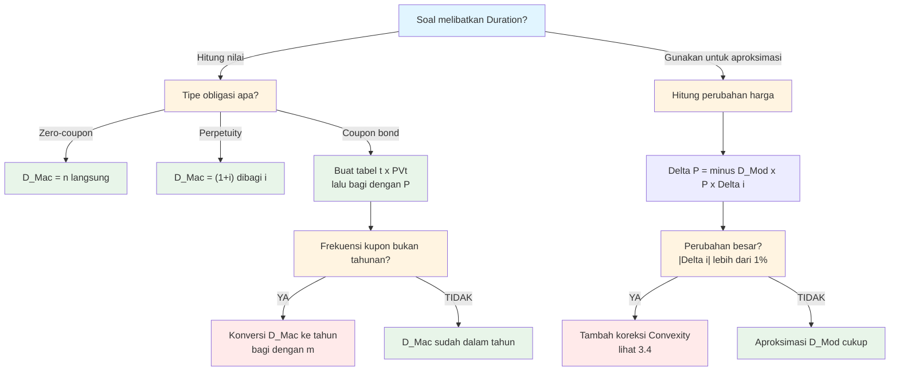

# 📘 3.3 — Duration (Macaulay and Modified)

> [!ABSTRACT] Ringkasan Cepat
> **Topik:** Duration — Macaulay & Modified | **Bobot:** ~20–30% | **Difficulty:** Hard
> **Ref:** Vaaler Bab 9 / Kellison Bab 10 | **Prereq:** [[2.1 Annuity-Immediate and Annuity-Due]], [[5.1 Bond Pricing]]

---

## Section 0 — Pemetaan Topik

| Field | Detail |
|-------|--------|
| **Topik CF1** | Topik 3 — Struktur Jangka Waktu Suku Bunga |
| **Sub-topik ID** | 3.3 Duration (Macaulay and Modified) |
| **Skill Diuji** | Calculate, Evaluate, Immunize |
| **Bobot** | 20–30% |
| **Difficulty** | Hard |
| **Prerequisite** | [[1.4 Accumulation and Present Value]], [[2.1 Annuity-Immediate and Annuity-Due]], [[5.1 Bond Pricing]] |
| **Connected Topics** | [[3.4 Convexity]], [[3.5 Immunization]], [[5.2 Book Value and Premium Discount Amortization]] |
| **Referensi** | Vaaler, L. et al. (2009). *Mathematical Interest Theory* (2nd ed.), Bab 9; Kellison, S. G. (2006). *The Theory of Interest* (3rd ed.), Bab 10 |

---

## Section 1 — Intuisi

Bayangkan Anda memegang dua obligasi yang sama-sama jatuh tempo dalam 10 tahun. Obligasi pertama tidak membayar kupon sama sekali — seluruh uang baru Anda terima di akhir tahun ke-10. Obligasi kedua membayar kupon besar setiap tahun, sehingga Anda sudah menerima sebagian besar uang Anda jauh sebelum tahun ke-10 berakhir. Secara teknis keduanya "10-tahun" — tetapi mana yang lebih rentan jika suku bunga tiba-tiba naik besok?

Jawabannya jelas: obligasi pertama. Karena seluruh uang Anda "terkunci" 10 tahun ke depan, kenaikan suku bunga akan memukul harganya jauh lebih keras. Obligasi kedua sudah "mengembalikan" sebagian uang Anda lebih awal lewat kupon, sehingga rata-rata waktu tunggu Anda sebenarnya lebih pendek dari 10 tahun.

Inilah inti **Macaulay Duration**: bukan sekadar berapa lama obligasi itu jatuh tempo, melainkan *berapa lama rata-rata tertimbang* Anda harus menunggu untuk menerima kembali uang Anda — dengan bobot setiap pembayaran sebesar kontribusi present value-nya terhadap total harga. Sedangkan **Modified Duration** mengubah angka tersebut menjadi alat praktis: ia memberi tahu Anda secara langsung, "jika suku bunga naik 1%, harga obligasi saya akan turun sekitar berapa persen?" — menjadikannya ukuran sensitivitas harga yang langsung bisa digunakan untuk mengelola risiko portofolio.

---

## Section 2 — Definisi Formal

> [!NOTE] Definisi Matematis — Macaulay Duration
> Macaulay Duration adalah rata-rata tertimbang waktu penerimaan cash flow, dengan bobot berupa present value relatif setiap cash flow terhadap total price:
>
> $$D_{Mac} = \frac{\displaystyle\sum_{t=1}^{n} t \cdot v^t \cdot CF_t}{\displaystyle\sum_{t=1}^{n} v^t \cdot CF_t} = \frac{\displaystyle\sum_{t=1}^{n} t \cdot v^t \cdot CF_t}{P}$$

**Variabel & Parameter:**

| Simbol | Makna | Satuan |
|--------|-------|--------|
| $D_{Mac}$ | Macaulay Duration | periode (tahun jika CF tahunan) |
| $D_{Mod}$ | Modified Duration | 1/yield (ukuran sensitivitas) |
| $CF_t$ | Cash flow pada waktu $t$ | mata uang |
| $v = \frac{1}{1+i}$ | Faktor diskonto efektif per periode | — |
| $i$ | Yield rate efektif per periode | — |
| $P$ | Harga (present value total) obligasi | mata uang |
| $n$ | Jumlah periode total | periode |
| $t$ | Waktu cash flow ke-$t$ | periode |

### Rumus Utama

**Macaulay Duration — Bentuk Umum:**

$$D_{Mac} = \frac{\sum_{t=1}^{n} t \cdot v^t \cdot CF_t}{P}$$

**Macaulay Duration — Obligasi Standar** (kupon $Fr$ tiap periode, redemption $C$ di $t=n$):

$$D_{Mac} = \frac{Fr \cdot (Ia)_{\overline{n}\|} + C \cdot n \cdot v^n}{P}$$

di mana $(Ia)_{\overline{n}\|} = \frac{\ddot{a}_{\overline{n}\|} - n \cdot v^n}{i}$ adalah present value increasing annuity.

**Modified Duration:**

$$D_{Mod} = \frac{D_{Mac}}{1 + i}$$

**Interpretasi Modified Duration — Aproksimasi Perubahan Harga:**

$$\frac{\Delta P}{P} \approx -D_{Mod} \cdot \Delta i$$

atau dalam bentuk absolut:

$$\Delta P \approx -D_{Mod} \cdot P \cdot \Delta i$$

**Dollar Duration (DV01)** — perubahan harga untuk pergeseran yield 1 basis point ($\Delta i = 0.0001$):

$$DV01 = D_{Mod} \cdot P \cdot 0.0001$$

### Asumsi Eksplisit

- **Yield curve flat:** Seluruh cash flow didiskon dengan yield tunggal $i$ yang sama. Perubahan $i$ diasumsikan paralel (semua maturity bergerak sama).
- **Perubahan yield infinitesimal:** Aproksimasi $\Delta P \approx -D_{Mod} \cdot P \cdot \Delta i$ hanya akurat untuk $|\Delta i|$ kecil. Untuk perubahan besar, koreksi konveksitas diperlukan (lihat [[3.4 Convexity]]).
- **Cash flow deterministik:** Tidak ada opsi callability. Jika ada call provision, gunakan Duration to Worst.
- **Reinvestasi pada yield yang sama:** Konsisten dengan asumsi YTM.

---

## Section 3 — Jembatan Logika

> [!TIP] Dari Time Diagram ke Formula Duration
> Bayangkan garis waktu horizontal. Di setiap titik $t$, ada panah ke atas sebesar $CF_t$. Kita tidak hanya menjumlahkan tinggi panah-panah itu (itu Price) — kita juga mengalikan setiap panah dengan "jarak" $t$ dari sekarang, lalu menimbang dengan present value-nya. Hasilnya adalah "pusat massa" dari distribusi present value cash flow sepanjang waktu. Semakin jauh pusat massa ini dari $t=0$, semakin besar Duration, dan semakin sensitif harga terhadap perubahan yield.

> [!IMPORTANT] Focal Date & Derivasi Modified Duration
> **Focal Date:** $t = 0$ (saat ini).
>
> Modified Duration diturunkan dari turunan pertama harga terhadap yield. Karena $P = \sum_{t} v^t \cdot CF_t = \sum_{t} (1+i)^{-t} \cdot CF_t$, maka:
>
> $$\frac{dP}{di} = \sum_{t=1}^{n} (-t) \cdot (1+i)^{-t-1} \cdot CF_t = -\frac{1}{1+i} \sum_{t=1}^{n} t \cdot v^t \cdot CF_t = -\frac{D_{Mac} \cdot P}{1+i}$$
>
> Sehingga:
>
> $$\frac{1}{P}\frac{dP}{di} = -\frac{D_{Mac}}{1+i} = -D_{Mod}$$
>
> Ini berarti $D_{Mod}$ adalah **elastisitas negatif harga terhadap yield** — persentase penurunan harga per unit kenaikan yield.

Derivasi $(Ia)_{\overline{n}\|}$ dalam rumus obligasi: Karena kupon $Fr$ dibayar di $t = 1, 2, \ldots, n$ dan redemption $C$ dibayar di $t = n$:

$$\sum_{t=1}^{n} t \cdot v^t \cdot CF_t = Fr \sum_{t=1}^{n} t \cdot v^t + C \cdot n \cdot v^n = Fr \cdot (Ia)_{\overline{n}\|} + C \cdot n \cdot v^n$$

di mana $\sum_{t=1}^{n} t \cdot v^t = (Ia)_{\overline{n}\|}$ adalah definisi standar increasing annuity-immediate (lihat [[2.3 Varying Annuities]]).

> [!DANGER] Dilarang
> - Menggunakan $n$ (jangka waktu hingga jatuh tempo) sebagai pengganti $D_{Mac}$ — ini hanya valid untuk zero-coupon bond
> - Lupa membagi dengan $(1+i)$ saat mengonversi $D_{Mac}$ ke $D_{Mod}$
> - Mengabaikan satuan: jika yield $i$ adalah **per tahun** dan CF **tahunan**, maka $D_{Mac}$ dalam **tahun** — jangan campur dengan periode semesteran tanpa konversi

---

## Section 4 — Contoh Soal

---

### Soal A — Fundamental

Sebuah obligasi memiliki face value $F = 1.000$, coupon rate $r = 8\%$ per tahun, redemption at par ($C = F = 1.000$), dan jatuh tempo dalam $n = 3$ tahun. Yield to maturity adalah $i = 10\%$ per tahun efektif. Hitung:
(a) Harga obligasi $P$
(b) Macaulay Duration $D_{Mac}$
(c) Modified Duration $D_{Mod}$

> [!SUCCESS] Solusi Soal A
>
> **1. Identifikasi Variabel**
> - $F = C = 1.000$, $r = 0{,}08$, sehingga kupon tahunan $Fr = 80$
> - $i = 0{,}10$, $v = \frac{1}{1{,}10} = 0{,}90909$
> - $n = 3$ tahun
>
> **2. Time Diagram**
> ```
> t=0          t=1      t=2      t=3
>  |            |        |        |
>  P           +80      +80    +80+1000
>  (outflow)                  (inflows)
> ```
>
> **3. Equation of Value** *(Focal Date: $t = 0$)*
>
> $$P = Fr \cdot a_{\overline{3}\|} + C \cdot v^3$$
>
> $$D_{Mac} = \frac{Fr \cdot (Ia)_{\overline{3}\|} + C \cdot 3 \cdot v^3}{P}$$
>
> **4. Eksekusi Aljabar**
>
> *(a) Harga:*
>
> $$a_{\overline{3}\|} = \frac{1 - v^3}{i} = \frac{1 - (1{,}10)^{-3}}{0{,}10} = \frac{1 - 0{,}75131}{0{,}10} = 2{,}48685$$
>
> $$P = 80 \times 2{,}48685 + 1.000 \times 0{,}75131 = 198{,}948 + 751{,}315 = 950{,}26$$
>
> *(b) Macaulay Duration — hitung $\sum t \cdot PV_t$:*
>
> | $t$ | $CF_t$ | $v^t$ | $PV_t = CF_t \cdot v^t$ | $t \cdot PV_t$ |
> |-----|--------|-------|------------------------|----------------|
> | 1 | 80 | 0,90909 | 72,727 | 72,727 |
> | 2 | 80 | 0,82645 | 66,116 | 132,231 |
> | 3 | 1.080 | 0,75131 | 811,420 | 2.434,259 |
> | **Σ** | | | **950,263** | **2.639,218** |
>
> $$D_{Mac} = \frac{2.639{,}218}{950{,}263} = 2{,}7774 \text{ tahun}$$
>
> *(c) Modified Duration:*
>
> $$D_{Mod} = \frac{D_{Mac}}{1+i} = \frac{2{,}7774}{1{,}10} = 2{,}5249$$
>
> **5. Verification**
> - $D_{Mac} = 2{,}78$ tahun, lebih kecil dari $n = 3$ tahun ✓ (harus selalu $< n$ untuk coupon bond)
> - Harga $P = 950{,}26 < C = 1.000$ karena $r = 8\% < i = 10\%$ → obligasi di bawah par (discount) ✓
> - $D_{Mod} < D_{Mac}$ karena dibagi $(1+i) > 1$ ✓

> [!WARNING] Exam Tips — Soal A
> - ⏱️ **Target waktu:** ~4 menit
> - ⚠️ **Common Trap:** Menggunakan $n = 3$ sebagai Duration tanpa menghitung — ini hanya benar untuk zero-coupon bond
> - 🔑 **Shortcut:** Buat tabel $t \cdot PV_t$ langsung — lebih cepat dan minim kesalahan dibanding menggunakan formula $(Ia)_{\overline{n}\|}$ secara manual untuk $n$ kecil

---

### Soal B — Exam-Typical

Suatu obligasi dengan face value $F = 5.000$, coupon rate $r = 6\%$ per tahun dibayar **semesteran** (yaitu $3\%$ per semester), redemption at par, dan jatuh tempo dalam 4 tahun. Yield to maturity adalah $i^{(2)} = 8\%$ per tahun (convertible semiannually). Hitung Macaulay Duration dalam **tahun**.

> [!SUCCESS] Solusi Soal B
>
> **1. Identifikasi Variabel**
> - Kupon per semester: $Fr/2 = 5.000 \times 0{,}03 = 150$
> - Yield per semester: $j = i^{(2)}/2 = 0{,}04$, sehingga $v_j = 1/1{,}04$
> - Total periode: $n = 4 \times 2 = 8$ semester
> - Redemption: $C = 5.000$
>
> **2. Time Diagram** *(dalam semester)*
> ```
> t=0   t=1   t=2   t=3  ...  t=7   t=8
>  |     |     |     |          |     |
>  P   +150  +150  +150       +150  +150
>                                   +5000
> ```
>
> **3. Equation of Value** *(Focal Date: $t = 0$, unit: semester)*
>
> $$P = 150 \cdot a_{\overline{8}\|j} + 5.000 \cdot v_j^8$$
>
> $$D_{Mac}^{(\text{semester})} = \frac{150 \cdot (Ia)_{\overline{8}\|j} + 5.000 \cdot 8 \cdot v_j^8}{P}$$
>
> **4. Eksekusi Aljabar**
>
> $$v_j^8 = (1{,}04)^{-8} = 0{,}73069$$
>
> $$a_{\overline{8}\|j} = \frac{1 - 0{,}73069}{0{,}04} = \frac{0{,}26931}{0{,}04} = 6{,}7327$$
>
> $$P = 150 \times 6{,}7327 + 5.000 \times 0{,}73069 = 1.009{,}91 + 3.653{,}43 = 4.663{,}34$$
>
> Untuk $(Ia)_{\overline{8}\|j}$, gunakan definisi tabel:
>
> | $t$ (sem) | $CF_t$ | $v_j^t$ | $PV_t$ | $t \cdot PV_t$ |
> |-----------|--------|---------|--------|----------------|
> | 1 | 150 | 0,96154 | 144,23 | 144,23 |
> | 2 | 150 | 0,92456 | 138,68 | 277,37 |
> | 3 | 150 | 0,88900 | 133,35 | 400,05 |
> | 4 | 150 | 0,85480 | 128,22 | 512,88 |
> | 5 | 150 | 0,82193 | 123,29 | 616,45 |
> | 6 | 150 | 0,79031 | 118,55 | 711,27 |
> | 7 | 150 | 0,75992 | 113,99 | 797,92 |
> | 8 | 5.150 | 0,73069 | 3.763,05 | 30.104,43 |
> | **Σ** | | | **4.663,36** | **33.564,60** |
>
> $$D_{Mac}^{(\text{semester})} = \frac{33.564{,}60}{4.663{,}36} = 7{,}2$$ semester
>
> **Konversi ke tahun** (1 tahun = 2 semester):
>
> $$D_{Mac}^{(\text{tahun})} = \frac{7{,}2}{2} = 3{,}6 \text{ tahun}$$
>
> **5. Verification**
> - $D_{Mac} = 3{,}6$ tahun $< n = 4$ tahun ✓
> - $r = 6\% < i^{(2)} = 8\%$ → harga di bawah par: $P = 4.663 < 5.000$ ✓
> - Obligasi dengan kupon lebih rendah dari yield → duration mendekati $n$, wajar $D_{Mac} = 3{,}6 \approx n = 4$ ✓

> [!WARNING] Exam Tips — Soal B
> - ⏱️ **Target waktu:** ~6 menit
> - ⚠️ **Common Trap #1:** Menghitung Duration dalam semester lalu lupa dibagi 2 untuk konversi ke tahun — jawaban akhir harus dalam satuan yang diminta soal
> - ⚠️ **Common Trap #2:** Menggunakan $i = 8\%$ efektif tahunan sebagai discount rate alih-alih $j = 4\%$ per semester — selalu konversi ke periode yang sesuai dengan frekuensi kupon
> - 🔑 **Shortcut:** Untuk $n$ kecil (≤ 10 periode), tabel $t \cdot PV_t$ lebih aman dari formula $(Ia)$

---

### Soal C — Challenging

Seorang manajer portofolio memiliki dua obligasi:
- **Obligasi X:** Zero-coupon, face value $10.000$, jatuh tempo $n = 5$ tahun
- **Obligasi Y:** Kupon $12\%$ per tahun (annual), face value $10.000$, redemption at par, jatuh tempo $n = 3$ tahun

Yield untuk semua obligasi: $i = 8\%$ per tahun efektif.

Manajer ingin membentuk portofolio dari X dan Y senilai total $P_{port} = 20.000$ (diukur pada $t = 0$) dengan **Macaulay Duration portofolio** tepat $= 4$ tahun. Tentukan nilai investasi di masing-masing obligasi.

> [!SUCCESS] Solusi Soal C
>
> **1. Identifikasi Variabel**
> - $i = 0{,}08$, $v = 1/1{,}08$
> - Obligasi X (zero-coupon, $n=5$): $D_{Mac}^X = 5$ tahun (sifat zero-coupon)
> - Obligasi Y (kupon $12\%$, $n=3$): perlu dihitung
> - Target: $D_{Mac}^{port} = 4$ tahun, $P_{port} = 20.000$
>
> **2. Hitung $D_{Mac}^Y$**
>
> Kupon tahunan: $Fr = 10.000 \times 0{,}12 = 1.200$
>
> | $t$ | $CF_t$ | $v^t$ | $PV_t$ | $t \cdot PV_t$ |
> |-----|--------|-------|--------|----------------|
> | 1 | 1.200 | 0,92593 | 1.111,11 | 1.111,11 |
> | 2 | 1.200 | 0,85734 | 1.028,81 | 2.057,61 |
> | 3 | 11.200 | 0,79383 | 8.890,87 | 26.672,62 |
> | **Σ** | | | **11.030,79** | **29.841,34** |
>
> $$D_{Mac}^Y = \frac{29.841{,}34}{11.030{,}79} = 2{,}706 \text{ tahun}$$
>
> **3. Equation of Value — Duration Portofolio**
>
> Misalkan $w_X$ = proporsi nilai portofolio di Obligasi X. Maka $w_Y = 1 - w_X$.
>
> Duration portofolio adalah rata-rata tertimbang nilai:
>
> $$D_{Mac}^{port} = w_X \cdot D_{Mac}^X + (1 - w_X) \cdot D_{Mac}^Y$$
>
> **4. Eksekusi Aljabar**
>
> $$4 = w_X \cdot 5 + (1 - w_X) \cdot 2{,}706$$
>
> $$4 = 5w_X + 2{,}706 - 2{,}706 w_X$$
>
> $$4 - 2{,}706 = (5 - 2{,}706)\, w_X$$
>
> $$1{,}294 = 2{,}294\, w_X$$
>
> $$w_X = \frac{1{,}294}{2{,}294} = 0{,}5641$$
>
> Nilai investasi:
>
> $$P_X = 0{,}5641 \times 20.000 = \mathbf{11.282}$$
>
> $$P_Y = (1 - 0{,}5641) \times 20.000 = \mathbf{8.718}$$
>
> **5. Verification**
>
> $$D_{Mac}^{port} = \frac{11.282}{20.000} \times 5 + \frac{8.718}{20.000} \times 2{,}706 = 2{,}821 + 1{,}179 = 4{,}000 \text{ tahun} \checkmark$$
>
> Duration portofolio tepat 4 tahun — sesuai target. ✓

> [!WARNING] Exam Tips — Soal C
> - ⏱️ **Target waktu:** ~8 menit
> - ⚠️ **Common Trap:** Mengira duration portofolio = rata-rata *sederhana* (tidak tertimbang) dari duration masing-masing obligasi — harus tertimbang oleh **nilai pasar** ($P$), bukan nilai nominal
> - ⚠️ **Common Trap #2:** Lupa bahwa zero-coupon bond: $D_{Mac} = n$ secara langsung — tidak perlu hitung tabel
> - 🔑 **Shortcut:** Soal "target duration" selalu bisa diselesaikan dengan persamaan linear satu variabel $w_X$ — setup persamaan dulu sebelum menghitung apapun

---

## Section 5 — Verifikasi & Sanity Check

> [!CHECK] Logic Check — Macaulay Duration
> - $D_{Mac}$ selalu **lebih kecil dari** $n$ untuk coupon bond dengan $i > 0$
> - $D_{Mac} = n$ **hanya** untuk zero-coupon bond
> - Jika coupon rate $r$ naik (dengan $i$ tetap) → $D_{Mac}$ **turun** (cash flow lebih berat di awal)
> - Jika yield $i$ naik (dengan $CF$ tetap) → $D_{Mac}$ **turun** (cash flow jauh di masa depan terdiskon lebih berat)
> - Jika $n$ naik → $D_{Mac}$ naik (tapi terbatas; untuk perpetuity: $D_{Mac} = (1+i)/i$)

> [!CHECK] Logic Check — Modified Duration & Sensitivitas Harga
> - $D_{Mod} < D_{Mac}$ selalu, karena $D_{Mod} = D_{Mac}/(1+i)$ dan $i > 0$
> - Jika yield naik ($\Delta i > 0$) → harga turun ($\Delta P < 0$): tanda minus di $\Delta P \approx -D_{Mod} \cdot P \cdot \Delta i$ ✓
> - Aproksimasi $D_{Mod}$ **selalu underestimate** penurunan dan **overestimate** kenaikan harga (karena convexity positif) — koreksi lihat [[3.4 Convexity]]

> [!CHECK] Logic Check — Duration Portofolio
> - $D_{Mac}^{port}$ adalah rata-rata tertimbang nilai pasar: $D_{Mac}^{port} = \sum_j w_j D_{Mac}^j$ di mana $w_j = P_j / P_{port}$
> - $D_{Mac}^{port}$ harus berada **di antara** duration terkecil dan terbesar dari komponen portofolio

### Metode Alternatif

Untuk obligasi standar dengan $C = F$, rumus Price/Duration dapat disederhanakan menggunakan **premium/discount decomposition** (Kellison, Bab 10): $P = C + (Fr - Ci) \cdot a_{\overline{n}\|}$. Pendekatan ini mempercepat perhitungan harga, namun untuk Duration tetap lebih aman menggunakan tabel $t \cdot PV_t$ secara eksplisit di exam.

---

## Section 6 — Visualisasi Mental

**Price-Yield Curve dan Peran Duration:**

Bayangkan grafik dengan sumbu X = yield $i$ dan sumbu Y = harga $P$. Kurva ini berbentuk **cembung ke atas** (convex). Pada sembarang titik di kurva ini, **kemiringan garis singgung** (tangent line) adalah $dP/di = -D_{Mod} \cdot P$. Duration adalah kemiringan relatif kurva tersebut (dalam nilai negatif). Semakin curam kemiringan, semakin besar Duration, semakin sensitif harga terhadap yield.

**Distribusi Present Value Cash Flow:**

Bayangkan "batang" vertikal di setiap titik waktu $t = 1, 2, \ldots, n$, dengan tinggi = $PV_t$. Duration adalah **pusat massa** dari distribusi batang-batang ini sepanjang sumbu waktu. Zero-coupon bond hanya punya satu batang di $t = n$, sehingga pusat massanya tepat di $n$. Coupon bond punya banyak batang di sepanjang garis waktu, sehingga pusat massanya tertarik ke arah $t = 0$.

### Hubungan Visual ↔ Rumus

- Tinggi batang pada $t$ = $v^t \cdot CF_t$ → ini adalah pembilang sebelum dikalikan $t$
- Luas total semua batang = $\sum v^t \cdot CF_t = P$ → ini adalah penyebut formula $D_{Mac}$
- Posisi pusat massa = $D_{Mac} = \sum t \cdot (v^t \cdot CF_t) / P$ → rata-rata tertimbang posisi $t$
- Kemiringan negatif kurva Price-Yield di titik $i$ saat ini = $-D_{Mod} \cdot P$ → ini adalah $dP/di$

---

## Section 7 — Jebakan Umum

> [!BUG] Kesalahan Unit Waktu
> - ✗ Menghitung $D_{Mac}$ dalam semester lalu melaporkan hasilnya seolah dalam tahun → ✓ selalu bagi dengan frekuensi kupon per tahun untuk konversi ke tahun
> - ✗ Menggunakan yield tahunan $i$ untuk mendiskon cash flow semesteran → ✓ konversi dulu: $j = i^{(2)}/2$ (jika nominal) atau $j = (1+i)^{1/2} - 1$ (jika efektif tahunan)

> [!BUG] Kesalahan Konseptual
> - **$D_{Mac} = n$ untuk semua obligasi:** Hanya benar untuk zero-coupon. Untuk coupon bond, $D_{Mac} < n$ selalu.
> - **Duration = sensitivitas harga secara eksak:** Duration hanya aproksimasi linier (orde pertama). Untuk perubahan yield besar, kesalahan bisa signifikan tanpa koreksi convexity.
> - **Modified Duration tanpa pembagi $(1+i)$:** Sering terjadi ketika kandidat buru-buru. $D_{Mod} = D_{Mac} / (1+i)$, bukan $D_{Mod} = D_{Mac}$.
> - **Duration portofolio bukan rata-rata sederhana:** Harus tertimbang oleh nilai pasar masing-masing aset.

> [!BUG] Kesalahan Interpretasi Soal
> - **"Duration dalam tahun" vs "dalam periode":** Jika soal meminta dalam tahun tapi CF semesteran, wajib konversi di akhir.
> - **"Yield 8% per tahun":** Ambigu — bisa efektif tahunan atau nominal (convertible semiannually). Baca konteks: jika kupon semesteran, hampir pasti $i^{(2)} = 8\%$ artinya $j = 4\%$ per semester.
> - **"Harga obligasi berubah X persen":** Pastikan menggunakan $D_{Mod}$, bukan $D_{Mac}$, untuk aproksimasi persentase perubahan harga.

> [!CAUTION] Red Flags — Kata Kunci Waspada
> - **"Zero-coupon"** → $D_{Mac} = n$ langsung, tidak perlu hitung tabel
> - **"Perpetuity"** → $D_{Mac} = (1+i)/i$, gunakan rumus khusus
> - **"Semiannual coupon"** → konversi yield ke per-semester sebelum apapun
> - **"Portfolio duration = X tahun"** → soal minta proporsi, setup persamaan linear $w \cdot D_1 + (1-w) \cdot D_2 = D_{target}$
> - **"Approximate price change"** → gunakan $D_{Mod}$; jika minta akurasi lebih tinggi → tambah convexity (lihat [[3.4 Convexity]])

---

## Section 8 — Ringkasan Eksekutif

> [!SUMMARY] Must-Remember
> 1. **Macaulay Duration:** $D_{Mac} = \dfrac{\sum_{t} t \cdot v^t \cdot CF_t}{P}$ — rata-rata tertimbang waktu, bobot = PV relatif
> 2. **Modified Duration:** $D_{Mod} = \dfrac{D_{Mac}}{1+i}$ — selalu lebih kecil dari $D_{Mac}$
> 3. **Aproksimasi harga:** $\Delta P \approx -D_{Mod} \cdot P \cdot \Delta i$ — tanda minus karena hubungan terbalik harga-yield
> 4. **Zero-coupon:** $D_{Mac} = n$ langsung; **Perpetuity:** $D_{Mac} = \dfrac{1+i}{i}$
> 5. **Portfolio:** $D_{Mac}^{port} = \sum_j w_j D_{Mac}^j$ di mana $w_j = P_j / P_{port}$

### Kapan Digunakan

- 🔑 **Trigger keywords:** *"duration"*, *"sensitivity"*, *"price change for 1% yield move"*, *"DV01"*, *"weighted average time"*, *"portfolio duration target"*
- 📋 **Scenario types:** Mengestimasi perubahan harga obligasi akibat perubahan yield; membentuk portofolio dengan target duration tertentu (precursor to [[3.5 Immunization]])

### Kapan TIDAK Boleh Digunakan

- Jika perubahan yield **besar** ($|\Delta i| > 1\%$) → koreksi convexity wajib, jangan hanya $D_{Mod}$ (lihat [[3.4 Convexity]])
- Jika obligasi **callable** → gunakan Duration to Worst, bukan rumus standar
- Jika yield curve **tidak flat** (berbeda untuk setiap maturity) → Duration standar tidak valid; gunakan key rate duration

### Quick Decision Tree



---

> [!QUOTE] Follow-up Options
> 1. *"Berikan contoh soal variasi Unknown Duration Target dengan 3 aset"*
> 2. *"Jelaskan hubungan [[3.3 Duration (Macaulay and Modified)]] dengan [[3.5 Immunization]]"*
> 3. *"Buat flashcard 1-halaman untuk topik Duration ini"*

*📖 Ref: Vaaler Bab 9 / Kellison Bab 10 | 🗓️ 2026-02-17 | #CF1 #Duration #StrukturJangkaWaktu*
